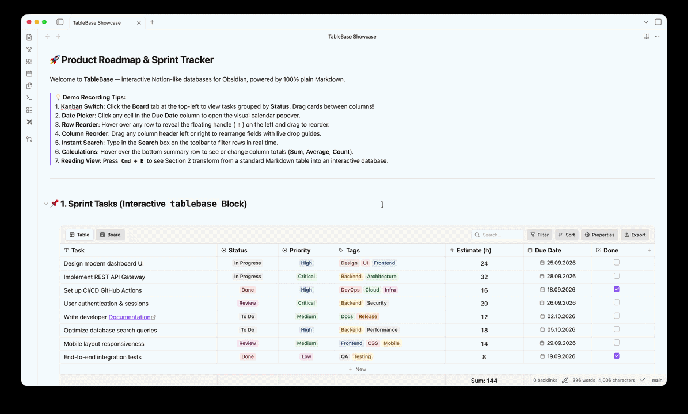
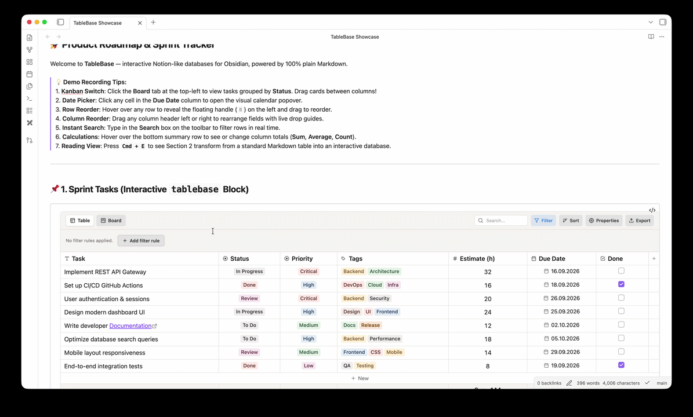

# TableBase for Obsidian

> **Transform standard Markdown tables into interactive Notion-like databases and Kanban boards — with 100% plain Markdown and zero vendor lock-in.**

[](https://github.com/a269ch/obsidian-tablebase/releases)
[](https://github.com/a269ch/obsidian-tablebase)
[](https://obsidian.md)
[](LICENSE)

---

## 📦 Installation

### From Obsidian Community Plugins *(Recommended)*
1. In Obsidian, open **Settings** → **Community plugins**.
2. Ensure **Restricted mode** is disabled.
3. Click **Browse**, search for **TableBase**, and click **Install** → **Enable**.

### Manual Installation
1. Download `main.js`, `manifest.json`, and `styles.css` from the [Latest Release](https://github.com/a269ch/obsidian-tablebase/releases).
2. In your vault folder, navigate to `.obsidian/plugins/` and create a folder named `tablebase`.
3. Copy `main.js`, `manifest.json`, and `styles.css` into `.obsidian/plugins/tablebase/`.
4. In Obsidian, go to **Settings** → **Community plugins**, click **Reload plugins**, and enable **TableBase**.

---

## 🚀 How It Works

TableBase reads and writes standard, human-readable Markdown tables — no proprietary files or hidden databases:

### 1. Standard Markdown Tables (Reading View)
Create normal Markdown tables anywhere in your notes:

```markdown
| Task | Status [select] | Tags [multi-select] | Due [date] | Budget ($) [number:sum] | Done [checkbox] |
| :--- | :---: | :--- | :---: | :---: | :---: |
| Redesign landing page | In Progress | Design, UI | 2026-09-25 | 1200 | [ ] |
| Implement auth API | Done | Backend | 2026-09-18 | 800 | [x] |
```

Press **`Cmd + E`** (switch to **Reading View**) — TableBase automatically renders the table as an interactive database.

### 2. Interactive Code Blocks (Live Preview & Reading View)
To view and edit an interactive database directly in **Live Preview** (Edit mode), wrap your table in a ```` ```tablebase ```` code block:

````markdown
```tablebase
| Task | Status [select] | Priority [select] | Due [date] | Done [checkbox] |
| Launch website | In Progress | High | 2026-09-25 | [ ] |
| Security audit | Done | Critical | 2026-09-18 | [x] |
```
````

---

## 🌟 Features & How to Use

### 📋 Interactive Table View



* **Edit Cells**: Double-click any cell or press `Enter` to edit text, numbers, dates, or tags.
* **Clickable Links**: Click `[Markdown links](url)`, raw URLs (`https://...`), or Obsidian `[[WikiLinks]]` to open them directly in your browser or notes.
* **Reorder Rows**: Hover over any row and drag the floating handle (`⠿`) in the left gutter to move rows up or down.
* **Reorder Columns**: Drag any column header left or right with live drop indicators (`before` / `after`).
* **Centered Controls**: Centered row index numbers and a centered `+ New` button at the bottom for quick row insertion.
* **Scroll Memory**: Automatically preserves your horizontal scroll position across edits, searches, and re-renders.

### 🗂️ 1-Click Kanban Board



* **Switch Views**: Click the **Board** tab on the top-left toolbar to transform your table into a Kanban board grouped by your status column.
* **Drag-and-Drop Cards**: Move cards between columns to update status values in your note in real time.
* **Card Properties**: Shows colored tags, dates, formatted numeric badges (`# Amount`), and clickable links directly on cards.
* **Quick Add**: Click `+ New` at the bottom of any column to create a card pre-assigned to that status.

### 🏷️ Colored Tags & Multi-Select
* **Single-Select Dropdowns**: Select a status (*Todo*, *In Progress*, *Done*) from a Notion-style dropdown menu.
* **Multi-Select Badges**: Add multiple tags per cell with instant search-as-you-type and badge creation.
* **Color Palettes**: Choose from 10 Notion-inspired palette colors or pick custom colors.

### 📅 Visual Date Picker
* Click any date cell to open an interactive calendar popover.
* Pick dates in one click or navigate across months and years.
* Supports common formats (`YYYY-MM-DD`, `DD.MM.YYYY`, `DD/MM/YYYY`, `MM/DD/YYYY`).

### 🔍 Search, Filter & Sort
* **Live Search**: Type into the **Search** box on the toolbar to instantly filter rows across all columns.
* **Visual Filters**: Click **Filter** to create rules with `AND` / `OR` logic (e.g. *Status is "In Progress" AND Due date is not empty*).
* **Multi-Column Sort**: Click **Sort** or click column headers to sort ascending or descending.
* **Properties Menu**: Click **Properties** to toggle visibility of any columns.

### 🧮 Summary Calculations
* Hover over the footer row beneath the table and click a column to pick a summary:
  * **Numbers**: `Sum`, `Average`, `Min`, `Max`, `Count`
  * **Tags & Text**: `Count all`, `Unique count`, `Empty`, `Not empty`
  * **Checkboxes**: `Checked count`, `Unchecked count`, `Percent completed`
* The calculation is saved in the header (e.g. `[number:sum]`), so your choice persists when reopening the note.

### 🖨️ Clean Print & PDF Export
* When printing notes or exporting to PDF, interactive UI controls (handles, toolbars, buttons) are automatically stripped, leaving clean, standard tables.

### 📤 CSV Export
* Open the table menu to **Copy as CSV** (for Excel, Google Sheets) or **Download CSV** file with a single click.

---

## 📝 Column Type Syntax

TableBase automatically detects column types based on content, or you can explicitly tag headers in your Markdown:

| Syntax | Column Type | Description |
| :--- | :--- | :--- |
| `Task [text]` | Text | Text cell with clickable links and wikilinks |
| `Status [select]` | Single-Select | Single-choice colored tag dropdown |
| `Tags [multi-select]` | Multi-Select | Multiple colored tag badges |
| `Due [date]` | Date | Visual calendar picker (`YYYY-MM-DD`) |
| `Due [date:DD.MM.YYYY]` | Date | Calendar picker with custom date format |
| `Amount [number]` | Number | Strict numeric formatting (right-aligned) |
| `Amount [number:sum]` | Number + Calc | Auto-calculates column Sum in footer |
| `Done [checkbox]` | Checkbox | Centered interactive checkbox |

*Type tags like `[select]` and `:sum` are automatically hidden in visual mode for a clean appearance.*

---

## ⌨️ Keyboard Shortcuts

| Key | Action |
| :--- | :--- |
| **`Arrow Keys`** | Navigate between cells |
| **`Tab`** / **`Shift + Tab`** | Move to next / previous cell (wraps to next row; `Tab` on last cell adds a row) |
| **`Enter`** | Edit cell, toggle checkbox, or open date/tag picker |
| **`Any letter / digit`** | Start typing immediately to edit the focused cell |
| **`Escape`** | Close editor, close popover, or cancel selection |
| **`Right Click`** | Open row or column context menu |

---

## ⚙️ Settings

Configure under **Obsidian Settings → TableBase**:
* **Default Date Format**: Set preferred date display (`YYYY-MM-DD`, `DD.MM.YYYY`, etc.).
* **Default Tag Format**: Format tags as comma-separated, `#hashtags`, or `[[wikilinks]]`.
* **Row Numbers**: Toggle row numbers globally.
* **Calculation Row**: Show or hide the bottom summary row.
* **Empty Board Properties**: Show placeholders (`+ Property`) for empty fields on Kanban cards.
* **Custom Tag Colors**: Assign permanent colors to specific tags across your vault.

---

## 🔒 100% Plain Markdown & Zero Lock-In

* All data is stored directly in your `.md` files as standard GitHub-Flavored Markdown tables.
* No hidden database files, no proprietary formats, no remote servers.
* If you disable or remove TableBase, all your notes and tables remain completely intact and readable anywhere.

---

## 📄 License

MIT License © 2026 Aleksei Chekodanov
